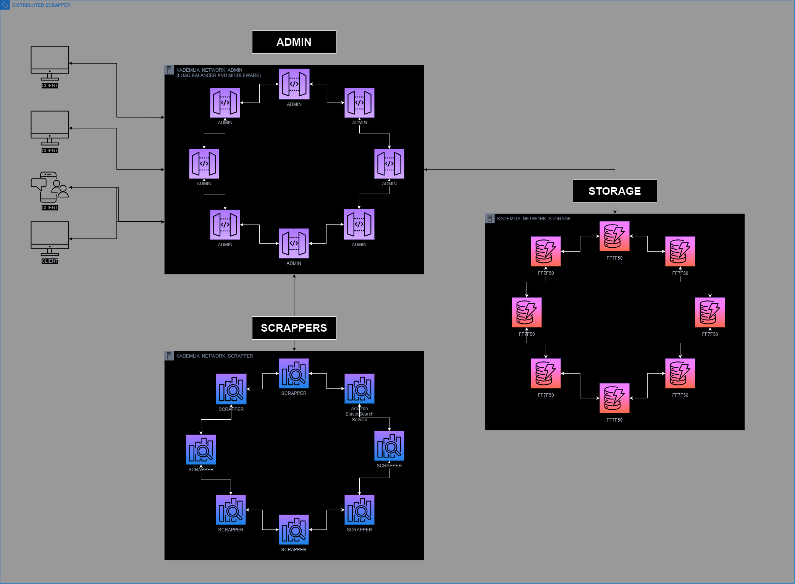

# Distributed-Scrapper

Una red distribuida de scraping web que utiliza nodos especializados para la recolección, procesamiento y almacenamiento de datos, asegurando alta disponibilidad y resiliencia en la extracción de información web.

## Integrantes

| Nombre                     | Grupo | Github                                   |
| -------------------------- | ----- | ---------------------------------------- |
| Brián Ameht Inclán Quesada | C411  | [@Usytwm](https://github.com/Usytwm)     |
| Davier Sanchez Bello       | C411  | [@DavierSB](https://github.com/DavierSB) |

## Ejecución del Proyecto

1. Clonar el repositorio del proyecto en tu máquina local:
   ```bash
   git clone https://github.com/Usytwm/Distributed-Scrapper.git
   ```
2. Levantar los nodos de la red:

   ```bash
   python src/main.py -t [scraper|storage|admin] -i [IP] -p [PUERTO]
   ```
   o
   ```bash
   python src/main.py --type [scraper|storage|admin] --ip [IP] --port [PUERTO]
   ```

3. Los nodos se comunicarán entre ellos para realizar el proceso de scraping, almacenamiento y balanceo de carga, siguiendo el esquema de roles de la red. El sistema se auto-configura y cada nodo emite un broadcast al unirse a la red.

## Idea General del Proyecto

Este proyecto consiste en la implementación de tres redes basadas en Kademlia, cada una con un rol específico dentro de la red distribuida general:

1. **Red de Scrapers**

   - Los **nodos scrappers** son responsables de realizar el scraping de las URLs enviadas por los nodos **admin**.
   - Cada nodo de esta red replica el estado de las URLs que han sido scrapeadas, así como el estado de cada nodo para evitar duplicación de tareas.
   - Como es una red distribuida, en todo momento cualquier nodo **scraper** sabe qué tareas están en progreso y cuál es el estado actual de las URLs que han sido procesadas.

2. **Red de Storage**

   - Esta red funciona como una implementación clásica de **Kademlia**, y se encarga de **guardar y devolver datos**.
   - Los nodos **storage** reciben los datos scrapeados de la red de **scrappers** a través de los nodos **admin**, y almacenan esta información de manera distribuida.

3. **Red de Admin**
   - Los nodos **admin** actúan como **middleware**, **balanceadores de carga** y **servidores de registro**.
   - Se encargan de registrar a cada nodo que se une a la red a través de un proceso de **broadcast**.
   - Mantienen una **cola de URLs** que están esperando para ser procesadas y gestionan la carga de los nodos **scraper**. Cuando un **scraper** no está saturado, el **admin** le envía solicitudes para procesar nuevas URLs.
   - Una vez que una URL es scrapeada, el resultado vuelve a la red de **admin** y estos datos se envían a la red de **storage** para ser almacenados.
   - Cualquier nodo, independientemente de su red, puede enviar datos para ser guardados, ya que la naturaleza de **Kademlia** permite la replicación de datos en toda la red.

## Flujo General

1. El **admin** recibe la URL a scrapeear y decide a qué nodo **scraper** asignarle la tarea basándose en la carga actual de la red.
2. El nodo **scraper** asignado procesa la URL y comparte el estado en su red para evitar duplicación de tareas.
3. Los resultados del scraping se envían al nodo **admin**, que los retransmite a la red de **storage**.
4. Cualquier nodo puede realizar operaciones de almacenamiento y los datos son replicados en la red de **storage** de acuerdo a las propiedades de **Kademlia**.

## Diagrama del Flujo de la Red

A continuación se muestra un diagrama del flujo de la red distribuida:


